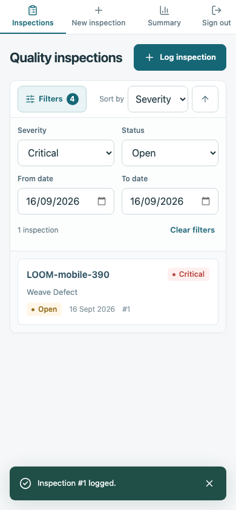
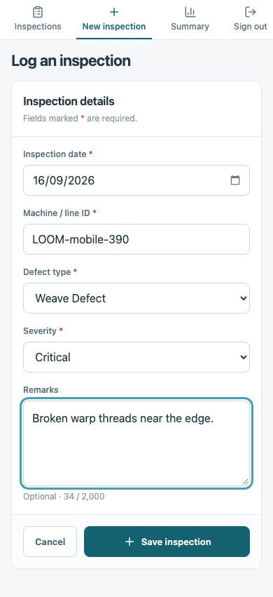
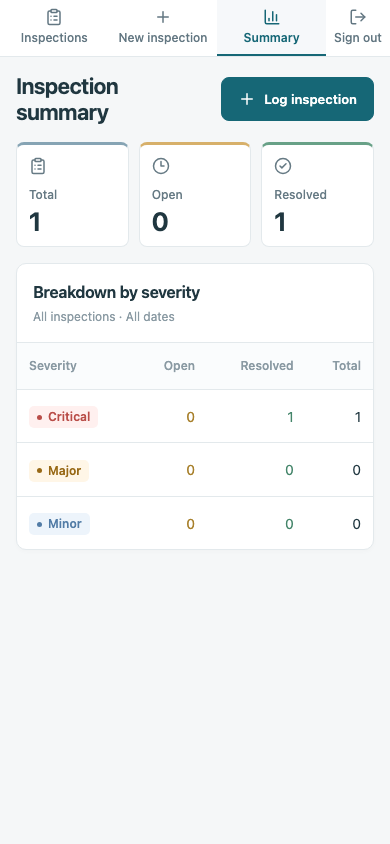

# Quality Inspection Tracker

A small web app for shop-floor supervisors to log fabric defects from a phone, work through them, and see what's still open. Built for the Arvind AI & Analytics full-stack assignment.

React and Vite on the front, Express on the back, SQLite through Node's built-in driver. One TypeScript project, five runtime dependencies.

<p>
  
  
  
</p>

## Running it

You need Node 22.13 or newer (`.nvmrc` says 24). There's no database to install.

```sh
npm ci
npm run dev
```

Open http://localhost:5173 and sign in with the password `supervisor`. The API listens on port 3000 and Vite proxies `/api` to it. The SQLite file appears at `data/inspections.sqlite` on first start.

Or, with only Docker installed:

```sh
docker compose up --build
```

and open http://localhost:3000. Data goes in a named volume, so it survives `down` and `up`.

A few more commands:

```sh
npm run seed                  # six sample inspections, only if the database is empty
npm run build && npm start    # production build, one Express process on :3000
```

Copy `.env.example` to `.env` to change the port, database path, password or webhook secret. The server prints a warning on startup while it's running on the default password.

## What's in it

The required pieces: log an inspection, filter and sort the list (severity, status, date range; four sort keys either way), resolve with a mandatory note, and a summary of open and resolved counts per severity.

The optional ones as well:

- **Sign-in.** One shared password (`APP_PASSWORD`) and an HMAC-signed session cookie good for 12 hours. There's no user table; everyone on a floor shares the login. The cookie is `HttpOnly` and `SameSite=Lax` but not `Secure`, because the whole point is opening it over plain http on a phone on the plant Wi-Fi.
- **Offline logging.** If the phone can't reach the server when you press Save, the inspection is queued in `localStorage`, shows up in a "Pending sync" panel, and is posted automatically when the browser comes back online or you sign in again. Every queued item carries a `clientRef` UUID and the server treats a repeated `clientRef` as the same inspection, so a retry after a lost response can't make a duplicate. This only covers a tab that's already open. There's no service worker, so cold-loading the app with no signal won't work.
- **Mock SAP webhook.** `POST /api/sap-webhook` with a bearer token creates an inspection tagged as coming from SAP. Details below.

## API

Bodies are JSON. Responses are `{ "data": ... }` or `{ "error": { "code", "message", "fields"? } }`. Everything under `/api/inspections` needs the session cookie and returns 401 without it.

| Method | Path                           | Notes                                                                                                                             |
| ------ | ------------------------------ | --------------------------------------------------------------------------------------------------------------------------------- |
| POST   | `/api/auth/login`              | `{ "password" }`. Sets the `session` cookie; 401 `INVALID_PASSWORD` otherwise.                                                    |
| GET    | `/api/auth/session`            | `{ "authenticated": true/false }`. Never 401.                                                                                     |
| POST   | `/api/auth/logout`             | Clears the cookie.                                                                                                                |
| POST   | `/api/inspections`             | 201 with the record and a `Location` header. 200 with the existing record if `clientRef` was seen before.                         |
| GET    | `/api/inspections`             | Filters `severity`, `status`, `dateFrom`, `dateTo`. Sorting `sortBy` (`date`, `severity`, `machineId`, `status`) and `sortOrder`. |
| GET    | `/api/inspections/summary`     | Open and resolved counts per severity, plus totals.                                                                               |
| GET    | `/api/inspections/:id`         | 404 if it doesn't exist.                                                                                                          |
| PATCH  | `/api/inspections/:id/resolve` | `{ "resolutionNote" }`. 409 if it was already resolved.                                                                           |
| POST   | `/api/sap-webhook`             | Needs `Authorization: Bearer <SAP_WEBHOOK_SECRET>`.                                                                               |
| GET    | `/api/health`                  | Public.                                                                                                                           |

Validation problems come back as 400 with a `fields` map keyed by field name. Unknown query parameters are rejected rather than ignored, which is stricter than usual but catches typos early.

```sh
# sign in and keep the cookie
curl -c jar -H 'Content-Type: application/json' -d '{"password":"supervisor"}' localhost:3000/api/auth/login

# log one
curl -b jar -H 'Content-Type: application/json' localhost:3000/api/inspections \
  -d '{"date":"2026-09-16","machineId":"LOOM-A12","defectType":"Weave Defect","severity":"Critical","remarks":"Broken warp threads near the selvedge."}'

# resolve it
curl -b jar -X PATCH -H 'Content-Type: application/json' localhost:3000/api/inspections/1/resolve \
  -d '{"resolutionNote":"Replaced the guide; the next sample was clean."}'
```

The webhook takes the same fields plus an optional `eventId`:

```sh
curl -H 'Authorization: Bearer sap-dev-secret' -H 'Content-Type: application/json' localhost:3000/api/sap-webhook \
  -d '{"eventId":"QN-100045","date":"2026-09-16","machineId":"DYE-B04","defectType":"Shade Variation","severity":"Major"}'
```

Posting the same `eventId` twice returns the first record with a 200 instead of creating another one. There's no signature check or replay window; a real integration would verify the sender and use SAP's notification number as the id.

## Decisions and trade-offs

**Node's built-in SQLite rather than better-sqlite3 or an ORM.** Nothing to compile, no second process, and the whole store is about 150 lines of plain SQL. The cost is a Node 22.13 floor, which the Docker route gets around. Queries are synchronous; that's fine at this volume and would be the first thing to revisit if the API got busy.

**One set of Zod schemas for the form and the API.** The browser validates with exactly the rules the server enforces, so messages match and limits live in one place. The SQLite `CHECK` constraints back that up, so a bad row can't get in even through the seed script.

**Filters live in the URL hash.** No router dependency, filters survive reload and navigation, and a filtered view is a link you can paste to someone. The hash is updated with `replaceState`, so typing a date doesn't fill up history.

**Migrations keyed off `PRAGMA user_version`.** Adding the `clientRef` column meant existing databases needed upgrading, so the store walks a short list of migrations on startup. It's the smallest thing that works, and there's a test that upgrades a real v1 file.

**Mobile first, in the stylesheet too.** The base rules are the 390px layout and two `min-width` breakpoints add the table and the sidebar. On a phone the filters fold behind a toggle so the first record is on screen without scrolling, inputs are 16px so iOS doesn't zoom, and tap targets are 44px or more.

## Assumptions

- Dates are plain `YYYY-MM-DD` strings with no timezone. The form defaults to the phone's local date. Past and future dates are both accepted.
- Machine/line IDs are free text up to 100 characters. Remarks and resolution notes up to 2,000.
- Resolved inspections are final: no editing, reopening or deleting. Two people resolving the same one at the same moment get one 200 and one 409.
- The list returns everything; there's no pagination. A single floor won't outgrow that for a good while.
- The summary counts every inspection, whatever the list is filtered to.

## What I'd do with more time

- A users table with per-supervisor logins and an audit trail of who resolved what.
- A service worker so the app itself loads offline, not only queues while it's open.
- Pagination and text search once the register gets long.
- Rate-limit the login endpoint. Nothing currently slows down a brute-force attempt on the shared password.
- Try it on real shop-floor phones with gloves on. The 390px Playwright run is a decent stand-in, but it isn't the same thing.

## Checks

```sh
npm run typecheck
npm run lint
npm test              # API tests against an in-memory database
npm run test:e2e      # Playwright at 390x844 and 1440x1000; first run: npx playwright install chromium
```

CI runs the same on Node 22 and 24. The browser tests start their own server on port 3101 with a throwaway database and never touch `data/`.
